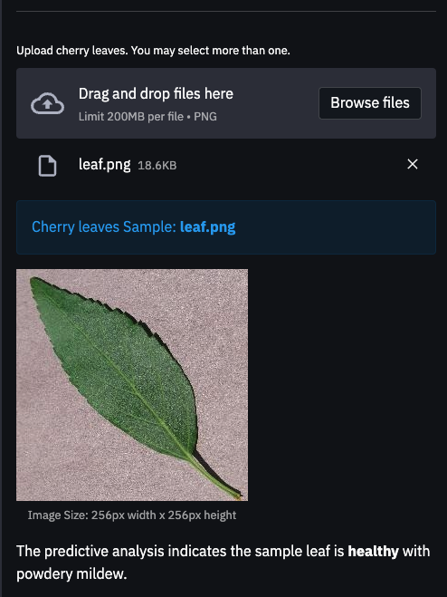

# Instant Mildew Detector

* Instant Mildew Detector is an app that uses predictive analytics to detect and predict the presence of powdery mildew on cherry leaves. The app takes an image of a cherry leaf as input and produces an output indicating whether the leaf is healthy or infected with powdery mildew. This app helps clients ensure that they are not supplying a compromised quality product to the market. 
* Instant Mildew Detector is designed using the classification model in machine learning. Therefore, it suggests a binary classifier, indicating whether a particular cherry leaf is healthy or contains powdery mildew.

## Dataset Content
* The dataset is sourced from [Kaggle](https://www.kaggle.com/codeinstitute/cherry-leaves). We then created a fictitious user story where predictive analytics can be applied in a real project in the workplace.
* The dataset contains +4 thousand images taken from the client's crop fields. The images show healthy cherry leaves and cherry leaves that have powdery mildew, a fungal disease that affects many plant species. The cherry plantation crop is one of the finest products in their portfolio, and the company is concerned about supplying the market with a compromised quality product.

## Business Requirements
The cherry plantation crop from Farmy & Foods is facing a challenge where their cherry plantations have been presenting powdery mildew. Currently, the process is manual verification if a given cherry tree contains powdery mildew. An employee spends around 30 minutes in each tree, taking a few samples of tree leaves and verifying visually if the leaf tree is healthy or has powdery mildew. If there is powdery mildew, the employee applies a specific compound to kill the fungus. The time spent applying this compound is 1 minute.  The company has thousands of cherry trees, located on multiple farms across the country. As a result, this manual process is not scalable due to the time spent in the manual process inspection.

To save time in this process, the IT team suggested an ML system that detects instantly, using a leaf tree image, if it is healthy or has powdery mildew. A similar manual process is in place for other crops for detecting pests, and if this initiative is successful, there is a realistic chance to replicate this project for all other crops. The dataset is a collection of cherry leaf images provided by Farmy & Foods, taken from their crops.

* 1 - The client is interested in conducting a study to visually differentiate a healthy cherry leaf from one with powdery mildew.
* 2 - The client is interested in predicting if a cherry leaf is healthy or contains powdery mildew.

## Hypothesis and how to validate?
* We suspect that powdery mildew leaves show clear signs of infection, such as light, roughly circular, powdery patches on young, susceptible leaves (light green expanding leaves). These patches can be distinguished from healthy leaves.

* An Image Montage shows that typically powdery mildew leaves have fine white marks across. Average Image, Variability Image, and Difference between Averages studies didn't reveal any clear pattern to differentiate one from another

## The rationale to map the business requirements to the Data Visualisations and ML tasks

* Business Requirement 1: Data Visualization

    * As a client I want to display the "mean" and "standard deviation" images for cherry leaves that are healthy and cherry leaves that contain powdery mildew, so that I can visually differentiate cherry leaves. 
    * As a client I want to display the difference between an average cherry leaf that is healthy and cherry leaf that contains powdery mildew, so that I can visually differentiate cherry leaves.
    * As a client I want to display an image montage for cherry leaves that are healthy and cherry leaves that contain powdery mildew, so that I can visually differentiate cherry leaves.  

* Business Requirement 2:

    * As a client I want to predict if a given cherry leaf is a healthy or contains mildew.
    * As a client I want to build a ML model and generate reports.

## Dashboard Design
This application has five main sections. These sections are
 

**1. Quick Project Summary**

This page gives general information, the project dataset summary and the client's requirements.

* Cherry Leaf Visualizer 

This page shows data visualization on three aspects.  The user can select either of the three check boxes at a time.

1. Difference between average and variability image

The first check box visualizes the "mean" and "standard deviation" images for powdery mildew contained and healthy leaf. 

2. The difference between average powdery mildew and healthy leaves.

This checkbox displays an example of an average leaf containing powdery mildew, an average healthy leaf and a different image. 

3. An image montage for powdery mildew or healthy leaves.

 In the image montage check box the user is expected to choose a label between healthy or powdery mildew to create a montage of random pre labelled images. every time we click the image montage button it generates a new montage of random images. 

**3. Mildew Detection**

This page contains 

* a link to download a set of cherry leaf images for live prediction (you may use the Kaggle repository that was provided to you).

* listing of the findings related to a study to visually differentiate a cherry leaf that is healthy from one that contains powdery mildew

* A user interface with a file uploader. The user can add images to the detector. Each image will display a prediction whether the image contains a healthy leaf or infected with powdery mildew.

If the user uploads an image of an infected leaf it will look like this.

If the user uploads an image that contains a healthy iamge will look like this.

**4. Project Hypothesis** 

This page shows the project hypothesis and how it is validated across the project.

 **5. Model performance Metrics**

This is a technical page which displays the model performance and it contains three plots.

1. Train, Validation and Test Set: Labels Frequencies

Out of the total 4208 datasets, 
 * The train set ratio is 0.7.
    * train - healthy: 1472 images. 
    * train - powdery_mildew: 1472 images
 * The validation set ratio is 0.1.
    * validation - healthy: 210 images
    * validation - powdery_mildew: 210 images
 * The test set ratio is 0.2. 
    * test - healthy: 422 images
    * test - powdery_mildew: 422 images

2. Model History

The agreed degree of accuracy criteria for the performance goal of the predictions with the client 
is a degree of 97% accuracy. The generalized performance on the Test set for the 'Instant Mildew Detector' app is 98%. 

## Unfixed Bugs
* There are no unfixed bugs in this project.
* Limitations of the frameworks: The Model History plot showing the accuracy and losses of the model appears to be overfitted. This may be due to a lack of sufficient data for training..

## Deployment
### Heroku

* The App live link is: https://YOUR_APP_NAME.herokuapp.com/ 
* The project was deployed to Heroku using the following steps.

1. Log in to Heroku and create an App
2. At the Deploy tab, select GitHub as the deployment method.
3. Select your repository name and click Search. Once it is found, click Connect.
4. Select the branch you want to deploy, then click Deploy Branch.
5. The deployment process should happen smoothly if all deployment files are fully functional. Click now the button Open App on the top of the page to access your App.

## Main Data Analysis and Machine Learning Libraries
* Numpy is used to handle multi-dimensional arrays and includes a wide set of mathematical functions to operate on these arrays. 
* Pandas is used for data analysis including performing statstical analysis. 
* Matplotlib is used for data visualization and helps in embedding plotts in Jupyter notebooks. 
* Seaborn provides a high-level intetrface for statstiical graphics and it offers a built-in themes for styling Matplot graphics. 
* Plotly is used for plotting data and and functions, add intteractivity and animation to data visualization. 
* Scikit-learn contain tools for predictive analysis. allows to train machine learning models for classification and clustetring. 
* tensorflow used to reduce the error in every iteration while fitting the model by using an optimiser and loss function.
* keras provides the python interface for artificial neural networks. 
* itertools used to iterate over data structures than can be sttepped over using a for-loop. 
* random is used to generate random numbers. 

## Credits 

* This app is built by forking the template proven by Code Institute and the codes are 
similar to the walkthrough project 1. 
* The description for data Analysis and Machine Learning Libraries are taken from the CI lecture notes/videos. 

### Content 

- The information regarding powdery mildew is taken from [Wikipedia](https://en.wikipedia.org/wiki/Powdery_mildew).

### Media

- The cherry leave images dataset are taken from [Kaggle](https://www.kaggle.com/codeinstitute/cherry-leaves).

## Acknowledgements 
* Thank you to the people at code institute and in the slack who have been an increidble resource throughout my time working on this project.
